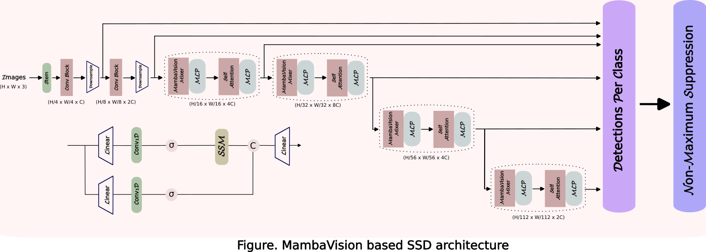

# Mamba-SSD: MambaVision Based SSD Object Detection

[](https://github.com/enesdoruk/ssd.mamba)


<p align="center">
  
</p>

<p align="center">
We present the implementation of the MambaVision model within the Single Shot MultiBox Detector (SSD) framework for enhanced object detection performance. MambaVision leverages advanced feature extraction techniques and attention mechanisms, enabling improved representation of complex visual patterns. We integrate MambaVision into the SSD architecture, optimizing the detection pipeline for real-time applications while maintaining high accuracy across various datasets. Our experimental results demonstrate a significant increase in mAP metrics, showcasing the efficacy of combining MambaVision's robust feature extraction capabilities with SSD's rapid detection framework.
</p>

#### Contents

1. [Installation](#Requirements)
1. [Datasets](#Datasets)
1. [Training](#Training)


## Installation
The following is an example based on PyTorch 2.4.1 with CUDA 12.4. For other versions, please refer to the official website of [PyTorch](https://pytorch.org/) 

```shell
# create environment
conda env create -f environment.yml
# activate environment
conda activate ssd
```

## Datasets
COCO, VOC2007, VOC2012, CityScapes and FoggyCityScapes datasets are available. 

### COCO
Specify a directory for dataset to be downloaded into, else default is ~/data/
```Shell
sh data/scripts/COCO2014.sh
```

### VOC Dataset
##### Download VOC2007 trainval & test
Specify a directory for dataset to be downloaded into, else default is ~/data/
```Shell
sh data/scripts/VOC2007.sh # <directory>
```
##### Download VOC2012 trainval
Specify a directory for dataset to be downloaded into, else default is ~/data/

```Shell
sh data/scripts/VOC2012.sh # <directory>
```

#### Cityscapes, Foggy Cityscapes
  - Download Cityscapes and Foggy Cityscapes dataset from the [link](https://www.cityscapes-dataset.com/downloads/). Particularly, we use *leftImg8bit_trainvaltest.zip* for Cityscapes and *leftImg8bit_trainvaltest_foggy.zip* for Foggy Cityscapes.
  - Unzip them under the directory like

```
data/cityscapes
├── gtFine
├── leftImg8bit
├── leftImg8bit_foggy
└── ...
```
Then run 
```
python utils/prepare_cityscapes_to_voc.py 
```
This will automatically generate dataset in `VOC` format.
```
data/cityscapes_in_voc
├── Annotations
├── ImageSets
└── JPEGImages
data/foggy_cityscapes_in_voc
├── Annotations
├── ImageSets
└── JPEGImages
```

## Training
```Shell
CUDA_VISIBLE_DEVICES=$GPU_ID \
       python train.py \
       --dataset VOC
       --dataset_root <dataset_root> \
       --end_epoch 100 \ 
       --lr 5e-3 
```


## Acknowledgement
My implementation borrows many parts from [ssd.pytorch](https://github.com/amdegroot/ssd.pytorch), [MambaVision](https://github.com/NVlabs/MambaVision), and [I3Net](https://github.com/czzbb/I3Net/tree/main)